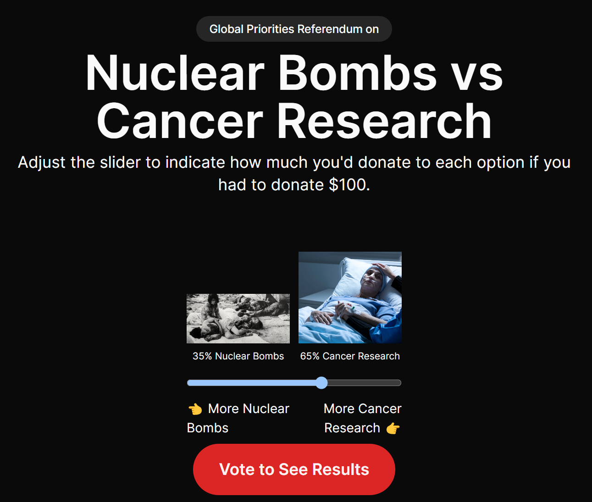

# Wishonia

## Overview
Wishonia is an imaginary magical kingdom
intended to envision a possible world
where scarce societal resources are optimally allocated to maximize wish fulfillment of its citizens.

# Problems

The world has a lot of problems like disease, poverty, and war.

Society makes far less progress in solving these problems than it could because:
1. **Limited Resources** -
   Society has limited resources to solve these problems, 
   and there's no systematic way to determine how much should be allocated to each problem.
2. **Inefficient Allocation** -
   Resources are often allocated based on political or emotional reasons rather than cost-effectiveness.
3. **Lack of Coordination** -
   There are many organizations working on the same problems without coordination.
   This leads to duplication of effort and waste.
4. **Lack of Accountability** -
   There's no way to track the impact of resources allocated to solving problems.
   This makes it difficult to determine what's working and what's not.
5. **Unintended Consequences** -
   Some solutions create new problems or have unintended side effects.
   Without tracking the impact of solutions, it's challenging to adjust resource allocation to minimize these effects.
6. **Limited Cognitive Capacity** -
   Humans have limited cognitive capacity and can't effectively weigh the relative importance of thousands of problems to determine the percentage of resources that should be allocated to each problem.
7. **Lack of Transparency** -
   There's a lack of transparency in how resources are allocated to solve problems.
   This makes it difficult for citizens to hold decision-makers accountable.
8. **Lack of Incentives** -
   Decision-makers often lack incentives to allocate resources efficiently.
   They may be more focused on short-term political gains than long-term societal benefits.
9. **Political Interference** -
   Political considerations often drive resource allocation decisions rather than evidence-based approaches.

# The Solution: A Wish Fulfillment System (WFS)

The core components of a Wish Fulfillment System (WFS) are:

1. **Problems**: A comprehensive list of societal problems that need to be solved.
2. **Budget**: A percentage of available resources allocated to solving each problem.
3. **Solutions**: A comprehensive list of proposed solutions for each problem.  It's also necessary to consider the cost-effectiveness of each solution and unintended side effects.  A solution may solve multiple problems or create new problems.
4. **Tasks**: A list of tasks that need to be completed to implement each solution.  Some tasks may contribute to multiple solutions.
5. **Solvers**: People or organizations responsible for completing each task.
6. **Progress**: Tracking the impact of each solution and adjusting resource allocation as needed.
7. **Results**: The outcomes of each solution and the overall positive and negative impact on society.

# The Wish Fulfillment Process

1. **Identify Problems**: Create a comprehensive list of societal problems that need to be solved.
2. **Prioritize Problems**: Determine the relative importance of each problem based on its impact on society.
3. **Solicit Proposals**: Create a comprehensive list of proposed solutions for each problem.
4. **Evaluate Solutions**: Determine the cost-effectiveness of each solution and unintended side effects.
5. **Allocate Resources**: Allocate resources to the most cost-effective solutions for each problem.
6. **Assign Tasks**: Assign tasks to people or organizations responsible for implementing each solution.
7. **Monitor Progress**: Track the impact of each solution and adjust resource allocation as needed.
8. **Review Results**: Evaluate the outcomes of each solution and the overall positive and negative impact on society.
9. **Adjust Allocation**: Adjust resource allocation based on the results of each solution and the changing needs of society.
10. **Repeat**: Continuously iterate on the wish fulfillment process to maximize societal well-being.

# Creating a Budget

One approach would be to create a list of societal wishes
and let everyone allocate a percentage of available resources to each wish and average the results.

However,
humans have limited cognitive capacity
and don't have the cognitive ability
to weigh the relative importance of thousands of wishes to effectively determine the percentage for each wish.

1. Make a comprehensive list of all societal wishes.
2. Show everyone a random pair of public goods.
3. Given $100 to allocate, how much would you allocate to efforts to solve each problem?

4. Collect everyone's allocations and calculate the average allocation for each problem.

Then we'll have a pie chart showing the percentage of available resources that should be allocated to each problem.

| **Goods/Services**                         | **Desired % of Total Spending**              |
|--------------------------------------------|----------------------------------------------|
| **Nuclear Weapons**                        | 0.5%                                         |
| **Military Services**                      | 15%                                          |
| **Cybersecurity Measures**                 | 0.1%                                         |
| **Crime Prevention Programs**              | 1%                                           |
| **Border Security**                        | 0.5%                                         |
| **Cancer Research**                        | 0.8%                                         |
| **Alzheimer's Research**                   | 0.2%                                         |
| **Renewable Energy Projects**              | 0.4%                                         |
| **Public Health Services**                 | 5%                                           |
| **Welfare Payments**                       | 6%                                           |
| **Medicaid and Medicare**                  | 15%                                          |
| **Mental Health Services**                 | 0.5%                                         |
| **Disaster Relief**                        | 0.3%                                         |
| **Public Education**                       | 15%                                          |
| **Cultural Grants**                        | 0.1%                                         |
| **Library Services**                       | 0.2%                                         |
| **Scientific Grants**                      | 0.4%                                         |
| **Transportation Infrastructure**          | 5%                                           |
| **Water and Sanitation Services**          | 2%                                           |
| **Public Parks and Recreation**            | 0.3%                                         |
| **Waste Management**                       | 0.5%                                         |
| **Bank Bailouts**                          | Variable; can be significant in crisis years |
| **Consumer Protection Services**           | 0.1%                                         |
| **Financial Regulation**                   | 0.3%                                         |
| **Incarceration for Marijuana Possession** | 0.4%                                         |
| **Legal Aid**                              | 0.1%                                         |
| **Judicial Systems**                       | 1.5%                                         |
| **Wildlife Protection**                    | 0.2%                                         |
| **Pollution Control**                      | 0.3%                                         |
| **Land Management**                        | 0.4%                                         |

This table provides a broad overview based on typical allocations in large, developed countries. The actual percentages can differ based on specific national budgets and policy priorities.

## 2. Solicit Proposals

1. For each problem, create a comprehensive list of all proposed solutions for each problem. For instance, for "Aging" we might have "Stem Cell Research", "Senolytics", etc.
2. 

## Installation
To set up this project locally, follow these steps:
1. Clone the repository to your local machine.
2. Navigate to the project directory.
3. Install the required dependencies using `pnpm install`.

## Features

1. Desired Allocation Poll: presents the user with a question asking how much they think should be spent on war (Option A) relative to clinical research (Option B). It includes a single slider input to allocate the percentage between the two options, along with two bars above the slider that dynamically visualize the allocation as the user adjusts the slider. The user submits their desired allocation by clicking the "Submit" button, and their response is saved in the browser's local storage.

2. Actual Allocation Poll: asking the user how much they think is actually spent on war (Option A) relative to clinical research (Option B). It includes the same slider input and dynamic bars for visualizing the allocation. The user submits their perceived actual allocation by clicking the "Submit" button, and their response is saved in the browser's local storage.

3. User Authentication: After completing both polls, the user is prompted to log in or register to view the results. They can log in using their email and password or through OAuth with Google. Upon successful login or registration, a new user record is created in the database, and their poll responses are retrieved from local storage and saved in the database.

4. Results Page: After logging in, the user is directed to the Results page, which displays their desired and perceived actual allocation percentages between "War" and "Clinical Research" using bar visualizations. The page also shows the average desired and perceived actual allocation percentages from all users using bar visualizations, allowing the user to compare their responses to the average person. The page includes a link to the petition page.

5. Petition Page: presents information about the petition to shift 1% of military spending to clinical research. It includes a form for users to sign the petition by providing their name, email, address, city, state, and zip code. Upon successful submission, the user is redirected to a thank you page.

6. Thank You Page: displays a message thanking the user for signing the petition and provides information about the next steps or updates related to the petition.

7. Profile Page: displays the user's unique referral link, which they can share with others to invite them to participate in the polls. It also shows a list of users who have signed up using the referral link, indicating whether they have completed the polls and signed the petition.

8. Social Sharing: allows users to easily share their participation in the polls and petition on social media platforms, with pre-populated posts and relevant hashtags.

9. Email Notifications: sends email notifications to users after they complete the polls, sign the petition, or refer someone to the app. Users can opt-out of email notifications if desired.

10. Localization: allows the app to support multiple languages based on the user's browser settings or a language selector, ensuring that the app's content, including questions and instructions, can be easily translated.

11. Gamification: introduces gamification elements to encourage user participation and engagement, such as a points or badge system for completing polls, signing the petition, or referring others. It may also include leaderboards to showcase top referrers or most active participants.

12. Personalized Experience: tailors the app's content and recommendations based on the user's previous interactions and preferences, providing personalized insights or comparisons based on their poll responses and suggesting related petitions or initiatives that align with their interests.

13. Data Visualization: enhances the Results page with interactive data visualizations, such as dynamic charts or graphs, allowing users to explore and compare the poll results based on different criteria, such as demographics or location. It may also provide downloadable reports or infographics for users to share or use in their advocacy efforts.
