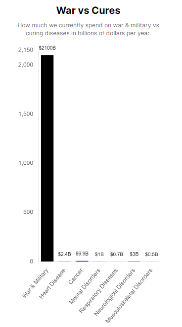

# Wishocracy: A Decentralized To-Do List for Humanity

**Wishocracy** is a decentralized, modular and interoperable protocol for optimally allocating societal resources to maximize universal wish fulfillment using collective intelligence.  It's meant to be a general-purpose system to be used by any organization like nonprofits, DAOs, businesses, etc.

**Wishonia** is an imaginary magical kingdom meant to illustrate the concept of Wishocracy and test the idea in a simulated virtual world to see how it works.

# Quick Start

1. **Install Dependencies**:

   - [Node.js](https://nodejs.org/en/) v18 or higher
   - [pnpm](https://pnpm.io/)
   - [Docker](https://www.docker.com/)

2. **Configure Environment Variables**:

   - Rename .env.example files to .env and configure the environment variables

3. **Start the Database With Docker**:

   ```sh
   docker-compose up -d
   ```

4. **Install pgvector**:

   ```sh
   docker exec -it wishocracy_server_1 npx prisma migrate deploy
   ```

5. **Install Dependencies**:

   ```sh
   pnpm install
   ```

6. **Seed the Database**:

Seed the database with default problems and wishes by running tests/seed.test.ts with the following command:
`sh
    jest tests/seed.test.ts
    `

# Why Are You Doing This?

How we currently allocate over 44% of societal resources:

https://github.com/mikepsinn/wishonia/assets/2808553/f2d859ad-a24f-410d-b95a-05410bfcb063

The result is that humanity spends 333 times more on fighting with each other than curing any disease.



**The most universal goal we all share is to
maximize the median health and happiness for sentient beings.**

As a human with this goal, you have a limited amount of time, energy, and resources to achieve it.

Unfortunately, there's a 99% chance that you're not doing it optimally.

Either:

- one of the other eight billion people on the planet is already doing what you're doing, and you're totally wasting your resources duplicating effort
- you're simply not doing the best thing that you could be doing, given your skills and resources

## Coordination Failure

The exponential coordination complexity problem illustrates how the number of potential lines of communication grows rapidly as more people are involved in a decision-making process.


This is visually represented in the graphs, where each additional person significantly increases the total number of connections needed for effective communication. This complexity can hinder our ability to make decisions efficiently, especially as group sizes increase.


However, digital twin AI agents, which are AI representations of individuals with higher cognitive bandwidth perfectly aligned to their preferences, can mitigate this issue. These agents can process vast amounts of information and make decisions more efficiently, acting on behalf of their human counterparts. By integrating these AI agents into a Global Todo List for humanity, we can streamline the coordination of efforts towards shared societal goals. These agents can continuously analyze data, predict outcomes, and suggest optimal actions, ensuring that resources are allocated effectively and that collaborative efforts are maximized. This approach can lead to more informed decision-making, reduced friction in communication, and accelerated progress towards achieving our collective objectives on a global scale.

# Solution: Collective Intelligence and Coordination

The best system we have for maximizing individual health and happiness is the free market.
It's a decentralized system that uses collective intelligence
to maximize wish fulfillment.
It works by letting everyone vote with their dollars to determine what everyone should be doing for 40 hours a week.
It's able to coordinate thousands of people who don't even know each other exist to produce goods and services that are more complex than any one person could produce on their own.

The invisible handle kind of turns humanity into a magical genie
that can produce innovations indistinguishable from magic to people who lived before Adam Smith.

https://github.com/mikepsinn/wishonia/assets/2808553/95c056e1-ee9c-4e90-b956-4a2e60d3ad0a

# Public Goods

The free market works well for producing private goods like pencils and iPhones.
However, it doesn't work well for producing public goods like solutions to societal problems.

We make far less progress in solving these problems than we could because:

1. **We Lack a System for Prioritizing Allocation of Scarce Resources** -
   Society has limited resources and thousands of problems.
   We have democratic systems and proposals with up-down votes,
   but they don't force the recognition that resources allocated to one problem are no longer available to solve other problems.
2. **Inefficient Allocation** -
   Resources are often allocated based on political or emotional reasons rather than cost-effectiveness.
3. **Lack of Coordination** -
   There are many organizations working on the same problems without coordination.
   This leads to unimaginable levels of duplicated effort and waste.
4. **Lack of Accountability** -
   There's no way to track the impact of resources allocated to solving problems.
   This makes it difficult to determine what's working and what's not.
5. **Unintended Consequences** -
   Some solutions create new problems or have unintended side effects.
   Without tracking the impact of solutions, it's challenging to adjust resource allocation to minimize these effects.
6. **Limited Cognitive Capacity** -
   Humans have limited cognitive capacity
   and can't effectively weigh the relative importance of thousands of problems
   to determine the percentage of resources that should be allocated to each problem or wish.
7. **Lack of Transparency** -
   There's a lack of transparency in how resources are allocated to solve problems.
   This makes it difficult for citizens to hold decision-makers accountable.
8. **Lack of Incentives** -
   Decision-makers often lack incentives to allocate resources efficiently.
   They may be more focused on short-term political gains than long-term societal benefits.

# The Solution: A Wish Fulfillment System

The core components of a Wish Fulfillment System are:

1. **Problems or Wishes**: A comprehensive list of societal problems that need to be solved or wishes to be fulfilled.
2. **Budget**: A breakdown of the percentage of available resources to allocate to solving each problem/wish.
3. **Solutions**: A comprehensive list of proposed solutions to solve each problem or realize each wish.
   It's also necessary to consider the cost-effectiveness of each solution and unintended side effects.
   A solution may solve multiple problems or create new problems.
4. **Tasks**: A list of SMART (Specific, Measurable, Achievable, Relevant, Time-bound) tasks that need to be completed to implement each solution.  Some tasks may contribute to multiple solutions.
5. **Solvers**: People/organizations responsible for completing each task.
6. **Progress**: Tracking the impact of each solution and adjusting resource allocation as needed.
7. **Results**: The outcomes of each solution and the overall positive and negative impact on society.

# The Wish Fulfillment Process

## Step 1. Catalog Wishes or Problems

Create a comprehensive list of societal goals or problems that need to be solved.

## Step 2. Create a Budget

Determine how much of our scarce resources should be allocated to solving each problem or fulfilling each wish.

There are a number of ways to do this like democracy and crowdfunding campaigns but they suffer from various limitations:

- **Representative Democracy:** The interests of representatives do not match the interests of all citizens.  Additionally, representatives have limited knowledge and cognitive capacity to effectively weigh the relative importance of thousands of wishes.
- **Crowdfunding Campaigns:** People vote with their dollars to determine the allocation of resources.  However, again humans have limited cognitive capacity to effectively weigh the relative importance of thousands of wishes.

### Aggregated Pairwise Preference Allocation (APPA)

A possible solution to this is **Aggregated Pairwise Preference Allocation (APPA)**.
This involves showing everyone a random pair of wishes or problems
and asking them to allocate a percentage of available resources to each.


By aggregating lots of pairwise allocations from lots of people, we may be to determine the percentage of available resources that should be allocated to each problem.


## Step 3: Create a List of Solutions

Allow people or AI agents to submit proposed solutions for each problem
or wish to create a comprehensive list of proposed strategies to fullfill each wish or solve each problem.

## Step 4: Evaluate Solutions

Again, use collective intelligence through Aggregated Pairwise Preference Allocation to determine the percentage of problem resources that should be allocated to each solution.
The evaluators should take into account the:

- **cost-effectiveness** of each solution
- **positive side effects** of the solution in terms of solving other problems
- **negative side effects** of the solution in terms of creating new problems

## Step 5. Create Tasks

Decompose each solution into a list of atomic tasks that need to be completed.
Each task should be SMART (Specific, Measurable, Achievable, Relevant, Time-bound).

Some tasks may contribute to multiple solutions,
so it's important to link tasks to multiple solutions so that they are not duplicated and that costs are shared across solutions.

## Step 6. Create Prizes

Offer rewards for completing tasks to incentivize the completion of tasks.

Possible ways to decide on the amount of the prize include:

- **Bidding:** People bid on the tasks by submitting the amount they would be willing to accept to complete the task
- **AI Prediction Markets:** Use AI to predict the cost of completing the task and offer a prize that is slightly higher than the predicted cost

## Step 6. Evaluate Submissions

Evaluate the completed tasks to determine if they meet the criteria for completion and award the prize.

## Step 7. Monitor Progress and Impact

Track the impact of each solution.
Evaluate the outcomes of each solution and the overall positive and negative impact on society.

## Step 8.  Feedback and Iterative Improvement

Provide impact data to people making pairwise allocations to help them make better decisions in the future.
This will enable continuous improvement in the allocation of resources to maximize wish fulfillment.

# How is Wishocracy Different from Other Systems?

- **Aggregated Pairwise Preference Allocation (APPA)**: This mechanism allows for scalable surfacing of the "wisdom of crowds" in budgeting resources across competing wishes/problems and evaluating potential solutions.
- **Iterative Feedback Loops**: The system should incorporate continuous improvement of allocations based on impact data and participant input.
- **Decentralized Task Allocation**: By decomposing solutions into atomic tasks and cost-sharing across multiple organizations, Wishocracy tries to minimize duplication of effort and maximize efficiency.

# Wishocracy Protocol

Here is a proposed design for Wishocracy as a decentralized, interoperable protocol composed of primitives to enable global integration with existing systems for task management and resource allocation:

## Wishocracy Protocol Primitives

The current models are available in the [Prisma schema here](prisma/schema.prisma).
However, we'll ultimately want to define these as JSON schemas and switch to a decentralized data store for interoperability.

1. **Wish/Problem Statement (WPS)**

- Globally unique identifier
- Title (short description)
- Detailed description
- Category tags
- Creation timestamp
- Creator ID (DID or public key)

2. **Pairwise Allocation Vote (PAV)**

- Voter ID (DID or public key)
- Wish/Problem A ID
- Wish/Problem B ID
- Allocation percentage for A
- Allocation percentage for B
- Timestamp

3. **Solution Proposal (SP)**

- Globally unique identifier
- Associated Wish/Problem ID(s)
- Title
- Detailed description
- Estimated cost
- Estimated impact
- Category tags
- Creation timestamp
- Creator ID

4. **Task Definition (TD)**

- Globally unique identifier
- Associated Solution Proposal ID(s)
- SMART task specification
  - Title
  - Detailed description
  - Measurable completion criteria
  - Due date
- Estimated cost
- Dependent Task IDs
- Category tags
- Creation timestamp
- Creator ID

5. **Task Allocation Commitment (TAC)**

- Allocated Task Definition ID
- Solver ID
- Committed budget
- Acceptance timestamp

6. **Task Submission (TS)**

- Allocated Task Definition ID
- Solver ID
- Deliverable data/proof
- Submission timestamp

7. **Task Evaluation Result (TER)**

- Task Submission ID
- Evaluator ID
- Evaluation score
- Evaluation notes
- Evaluation timestamp

8. **Impact Report (IR)**

- Associated Solution Proposal ID(s)
- Reporting period
- Impact metrics
  - Quantitative measures
  - Qualitative outcomes
- Associated Task Submission IDs
- Report timestamp
- Reporter ID

# Integration and Interoperability

These primitives can be represented as standardized data schemas (e.g., JSON, XML, RDF) that can be stored, queried, and interlinked across disparate systems via decentralized data networks like IPFS, GUN, Ceramic, etc.

Existing task management or resource allocation platforms can map their internal data models to these common primitives, and publish/subscribe to relevant data streams. This allows different systems to coordinate on a global "task graph" without tight coupling.

Some example integration patterns:

- A DAO's internal project management system can automatically generate Task Definitions from its own tasks/issues/bounties and publish them for external contributors to submit Task Allocation Commitments and Task Submissions.
- A public goods crowdfunding platform can post funded initiatives as Solution Proposals, and allocate a portion of the raised funds to Task Definitions drawn from Wishocracy's task graph.
- An analytics platform can aggregate Impact Reports from multiple sources to surface insights on global resource allocation efficiency and identify neglected areas or emerging opportunities.

By defining these common primitives and leveraging decentralized data networks, Wishocracy can serve as a connective tissue that enables various task management and resource allocation systems to interoperate towards the shared goal of optimizing global effort, without requiring disruptive changes to their existing workflows.

# Potential Challenges

1. **Framing**: Carefully framing wishes/problems and solution options to be evaluable by laypeople, potentially requiring an intermediate expert translation stage.
2. **Incentivization**: Incentivizing task completion, especially for large and long-term tasks, solely through prizes. Alternative incentive structures may need to be considered.
3. **Impact Measurement**: Measuring and attributing impact, especially for tasks and solutions with long time horizons and multi-faceted outcomes, is crucial for steering the system effectively.

# General Functions of Wishocracy

1. **Wish Management System**: A system for creating, categorizing, and prioritizing wishes or problems that need to be solved.
2. **Budget Allocation System**: A system for determining how much of our scarce resources should be allocated to solving each problem or fulfilling each wish.
3. **Solution Management System**: A system for creating, categorizing, and evaluating proposed solutions to solve each problem or fulfill each wish.
4. **Task Management System**: A system for decomposing each solution into a list of atomic tasks that need to be completed.
5. **Wisher Relationship Management (WRM) System**: A system for tracking the relationship between wishes, solutions, tasks, and wishers.  This is similar to a Customer Relationship Management (CRM) system but for global coordination between Wishers.

# Digital Twins

We'd like to allow people to create Digital Twins of themselves in the simulated World of Wishonia.
Digital Twins are meant to be autonomous agents to work together to find positive sum games,
figure out how their analog real-world counterparts can work together to maximize wish fulfillment.
They should also be able to use tools and interact with the world to automate the production of public goods.

A Digital Twin is a digital representation of a person that is defined by their:

- **Wishes**: What they want to accomplish in the world
- **Skills**: What they're good at
- **Resources**: What they have to offer
- **Interests**: What they're interested in
- **Time**: How much time they have to offer
- **Reputation**: How trustworthy they are
- **Network**: Who they know
- **Location**: Where they are
- **Language**: What languages they speak

Functionally, it consists of:

- **A Large Language Model**: To understand and generate text
- **A Knowledge Graph**: To store and reason about the person's wishes, skills, resources, interests, time, reputation, network, location, and language
- **A Vector Database**: To store and query the person's knowledge graph using retrival

## Additional Stuff to Consider

1. **Dependency Specification**: Allowing specification of dependencies between wishes, problems, solutions, and tasks to create a network of links and surface efficiencies.
2. **Matching Engine**: Adding a layer for matching tasks and solutions to people and teams based on skills, experience, resources, and interest.
3. **Governance Mechanisms**: Developing mechanisms for handling disputes, gaming behaviors, and bad actors to ensure system integrity.
4. **Transparency and Explainability**: Incorporating features that allow participants to see how decisions were made and drill down from high-level priorities to specific tasks and vice versa.

# Next Steps

1. **Integrate Existing Public Goods Protocols and Platforms**:
   Identify and analyze existing projects and platforms that aim to optimize resource allocation such as Gitcoin Grants, HyperCerts, and others. Figure out how Wishocracy can complement or integrate with them.
2. **Prototype Development**: Creating prototypes of the system, even if focused on a narrow domain, to validate and refine the core mechanics.
3. **Domain Application**: Exploring applications of Wishocracy within various contexts such as organizations, DAOs, governments, or global scale initiatives.
4. **Integration with Existing Task Management Systems**: Developing integrations with existing task management systems to facilitate task import, syncing, creation, assignment, and tracking.
5. **Iterative Refinement**: Continuously gathering feedback and iterating on the system design to address challenges and incorporate new features.

# Frequently Asked Questions

## Q: Isn't this insanely over-ambitious?  Why not just focus on smaller focused goals?

The goal is to minimize wasted duplication of effort to optimize societal resource allocation.
By limiting its scope to small organizations, it would not be able to prevent duplication of effort on a global scale.

Furthermore,
research has shown that the quality of decisions made by groups is proportional to the diversity of the group. By focusing on a global scale, Wishocracy can tap into the wisdom of the crowd to make better decisions than any one person or small group of people could make.

This requires that Wishocracy be more of a decentralized protocol that can integrate with any existing system rather than a standalone system.

## Q: What's the benefit of a global todo list. How would an individual's vote matter? Doesn't the government make decisions on what problems are to be prioritized?

The goal of Wishocracy isn't to replace existing governments, DAOs, nonprofits or other organizations but to
help them coordinate and make optimal resource allocation decisions.

The key potential benefits of a global, decentralized todo list are:

1. **Preventing Waste** - Minimizing duplicated effort by surfacing what problems/wishes people are already working on solving. This allows resources to be allocated more efficiently. Governments and charitable foundations spend billions on solving important problems, but lack of coordination often leads to significant duplication of effort. For instance, if two research organizations each spend $1 million doing animal trials on the same drug, that's effectively $1 million of funding wasted and lots of extra animals suffering for no reason.

2. **Information** - In democracies, representatives are supposed to do what people want.  
But how can they do that if we don't have a system to create a budget that illustrates what everyone wants?
[Aggregated Pairwise Preference Allocation](#aggregated-pairwise-preference-allocation-appa) is a unique way to quantify what everyone wants.
Thus, just having this information available to representatives would actually make it possible for representatives to do what people want.

3. **Coordination and Cost-Sharing** -
   By decomposing solutions into atomic tasks
   that anyone can contribute to, it enables cost-sharing between organizations that need the same thing.  
This would enable all organizations to accomplish more with the same amount of resources.

4. **Helping People Maximize Their Impact** - Say you're a charitable individual who wants to improve the world. How can you figure out what the most important thing you can do  A global decentralized to do list could help charitable people find the highest impact tasks to work on given their skills and resources.

5.  **Iterative Improvement through Impact Tracking** - Iteratively improving allocation of resources over time by feeding impact data back into the prioritization process. The system gets smarter.

The key is to start with small-scale experiments and grow gradually, 
while maintaining the north star of empowering individuals to self-organize to solve important problems, 
augmenting rather than replacing existing institutions. 
