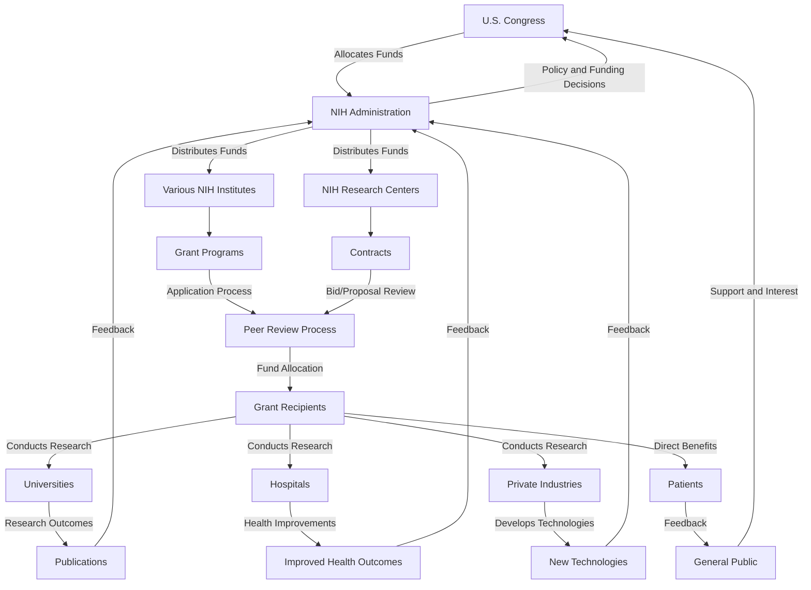
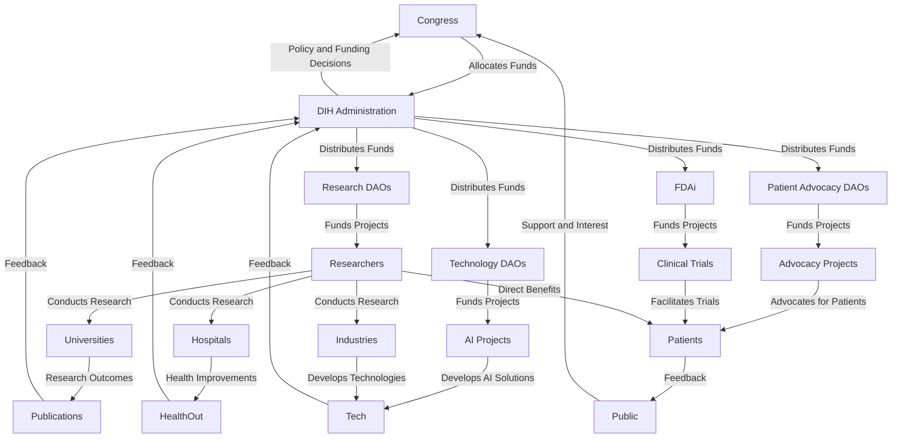
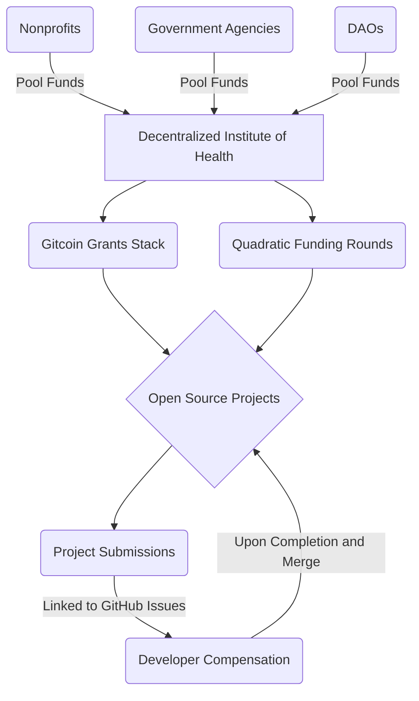

# The Decentralized Institutes of Health

Through decentralized science (DeSci), artificial intelligence (AI),
and leveraging the Gitcoin Grants Stack,
a Decentralized Institutes of Health (DIH)
could facilitate a significant reallocation of resources and human capital from war to the development of medical breakthroughs. 

### Organizational Framework

DIH operates through a network of Decentralized Autonomous Organizations (DAOs) dedicated to fostering innovation within specific areas of health and medical research:

- **Research DAOs**: Groups such as VitaDAO and AthenaDAO would focus on specialized research, employing tokenized models to ensure that public goods and stakeholder-driven development are at the forefront.
- **Technology DAOs & Projects**: With initiatives like Inference Labs and The Bittensor Hub decentralizing the AI stack, DIH could use these tailored AI solutions to propel medical research forward.
- **Patient Advocacy DAOs**: These entities align research and healthcare priorities with patient needs and perspectives.
- **FDAi**: An AI agent designed for everyone that automates, aggregates, and analyzes data, publishes results, offers real-time decision support, and facilitates clinical trial participation across therapeutic areas.

### Core Functionalities

DIH approach to healthcare research and development:

- **Democratic Funding via Gitcoin Grants Stack**: This model dramatically shifts funding allocation towards projects with strong community backing.
- **FDAi Integration**: By automating clinical research processes, the FDAi significantly enhances personalized healthcare, making cutting-edge research and treatment options more accessible.

### Funding Mechanism

- **Redistribution of War Budgets**: DIH's funding model focused on reallocating war expenditures to health research, embodying a democratic ethos that prioritizes life and well-being.

### Technology

DIH's technological infrastructure would incorporate:

- **Blockchain & AI**: For secure operations and advanced data analysis.
- **Decentralized Data Management**: Facilitating patient recruitment and leveraging composable research elements for a streamlined research process.

### Key Projects and Collaborations

Key components and collaborations within DIH include:

- **BioDAOs & LLMs**: These entities leverage AI and tokenized models for drug development and personalized care.
- **Reputation Systems & DIDs**: Enhancing the research community's trust and collaboration through platforms like 0xHolonym.

### Strategy

The overarching strategy of DIH includes the synergistic operation of AI-powered BioDAOs, DKGs, and Hypercerts,
aiming to create a decentralized, autonomous framework for clinical discovery.

# Product Requirements

Product Requirements Document (PRD)
Decentralized Institutes of Health (DIH) Platform

1. Introduction
   1.1 Purpose
   The purpose of this document is to outline the requirements for the development of the Decentralized Institutes of Health (DIH) platform, a decentralized, democratic, and transparent system for funding and managing medical research projects that prioritize public goods and open access to intellectual property (IP). The platform aims to be a viable alternative to centralized organizations like the National Institutes of Health (NIH) and World Health Organization (WHO).

   1.2 Scope
   The DIH platform will be built using blockchain technology, leveraging the Gitcoin Grants Stack and other decentralized tools to enable quadratic funding, community governance, and public ownership of research outputs. The platform will be accessible to users with varying levels of web3 experience, supporting both fiat and cryptocurrency donations. It will also incorporate features to ensure regulatory compliance, scientific review, IP management, funding diversification, collaboration, data management, education, and monitoring.

2. Functional Requirements
   2.1 User Roles
    - Researchers: Submit project proposals and manage funded projects
    - Funders: Contribute funds to projects and participate in governance
    - Reviewers: Evaluate project proposals and provide feedback
    - Administrators: Oversee platform operations and resolve disputes
    - Regulators: Ensure compliance with relevant healthcare regulations
    - Experts: Provide guidance on research priorities and validate findings

   2.2 Project Submission
    - Researchers can submit project proposals with a description, funding goal, timeline, and regulatory compliance plan
    - Proposals are stored on a decentralized storage solution (e.g., IPFS) and associated with a unique identifier and smart contract

   2.3 Quadratic Funding
    - Funders can contribute to projects using cryptocurrency, stablecoins, or fiat currency
    - Contributions are matched using the quadratic funding formula, with funds allocated from a diversified pool of sources
    - Smart contracts automatically distribute funds to projects based on the funding round results

   2.4 Community Governance
    - Funders, stakeholders, and experts participate in platform governance through a DAO
    - Governance decisions include funding priorities, platform upgrades, and dispute resolution
    - Voting power is proportional to contributions, reputation scores, and expertise

   2.5 Reputation System
    - Researchers, funders, and reviewers have reputation scores based on their platform activity and external validation
    - Reputation scores influence voting power, project visibility, and funding eligibility

   2.6 Project Management
    - Funded projects are managed through a decentralized project management system with milestone tracking and reporting
    - Funds are released in tranches based on milestone completion, regulatory compliance, and community approval

   2.7 Intellectual Property Management
    - A flexible IP framework balances open access with the need for limited protection to incentivize innovation
    - The platform provides guidance and support for researchers navigating IP issues and technology transfer processes

   2.8 Scientific Review and Validation
    - A decentralized peer review system ensures the scientific merit and validity of proposed projects
    - Expert committees oversee specific research areas and provide guidance on funding priorities
    - Collaboration with established scientific institutions and journals helps validate and disseminate research findings

   2.9 Regulatory Compliance
    - The platform complies with relevant healthcare regulations (e.g., HIPAA, GDPR, FDA) and ensures funded projects adhere to ethical standards
    - Mechanisms are in place for decentralized clinical trials and drug approval processes

   2.10 Funding Diversification
    - The platform seeks partnerships with governments, foundations, and corporations to diversify its funding sources
    - Innovative funding models, such as impact investing and outcome-based financing, are explored

   2.11 Collaboration and Partnerships
    - The platform fosters collaboration among researchers, institutions, and stakeholders to maximize impact
    - Partnerships with healthcare organizations, NGOs, and patient advocacy groups help identify research priorities and disseminate findings

   2.12 Data Management and Sharing
    - Robust data management and sharing protocols ensure the security, privacy, and interoperability of research data
    - Decentralized storage solutions and privacy-preserving technologies are leveraged

   2.13 Education and Outreach
    - The platform invests in education and outreach initiatives to raise awareness about decentralized healthcare research
    - Partnerships with universities and educational institutions help train the next generation of decentralized healthcare researchers

   2.14 Monitoring and Evaluation
    - A comprehensive monitoring and evaluation framework assesses the impact and effectiveness of funded projects
    - Key performance indicators (KPIs) are defined and tracked to measure progress towards the platform's goals
    - Regular reporting and auditing processes ensure transparency and accountability

## How the National Institutes of Health  Works

## How the Decentralized Institutes of Health Would Work

## Decentralized Institutes of Health: Key Components

3. Non-Functional Requirements
   3.1 Security
    - The platform must be resistant to attacks, hacks, and unauthorized access
    - All transactions and data storage must be encrypted and secure
    - Regular security audits and bug bounties should be conducted

   3.2 Scalability
    - The platform must be able to handle a large number of projects, funders, and transactions
    - The architecture should be designed to scale horizontally as the platform grows
    - Off-chain solutions and layer-2 scaling should be considered for high-volume activities

   3.3 Usability
    - The platform should have a user-friendly interface for all user roles
    - Clear documentation and tutorials should be provided
    - The platform should be accessible to users with varying levels of technical expertise

   3.4 Compatibility
    - The platform should be compatible with popular blockchain networks (e.g., Ethereum, Polygon)
    - Integration with existing decentralized finance (DeFi) and decentralized identity (DID) solutions should be considered
    - The platform should be interoperable with other decentralized science (DeSci) platforms and tools

4. Constraints
    - The platform must be developed using open-source technologies
    - The platform must comply with relevant regulations and legal frameworks
    - The platform must be launched within a specified timeframe and budget

5. Assumptions and Dependencies
    - The platform assumes the availability of sufficient funding and resources for development and maintenance
    - The platform depends on the continued growth and adoption of blockchain and decentralized technologies
    - The platform assumes the willingness of researchers, funders, and stakeholders to participate in a decentralized model

6. Glossary
    - DAO: Decentralized Autonomous Organization
    - DeSci: Decentralized Science
    - DID: Decentralized Identity
    - IPFS: InterPlanetary File System
    - IP: Intellectual Property
    - PRD: Product Requirements Document

7. References
    - Gitcoin Grants Stack: https://gitcoin.co/grants/
    - Gitcoin Passport: https://passport.gitcoin.co/
    - Quadratic Funding: https://wtfisqf.com/
    - Decentralized Science (DeSci): https://desci.pub/
    - Fortmatic: https://fortmatic.com/
    - Torus: https://tor.us/

