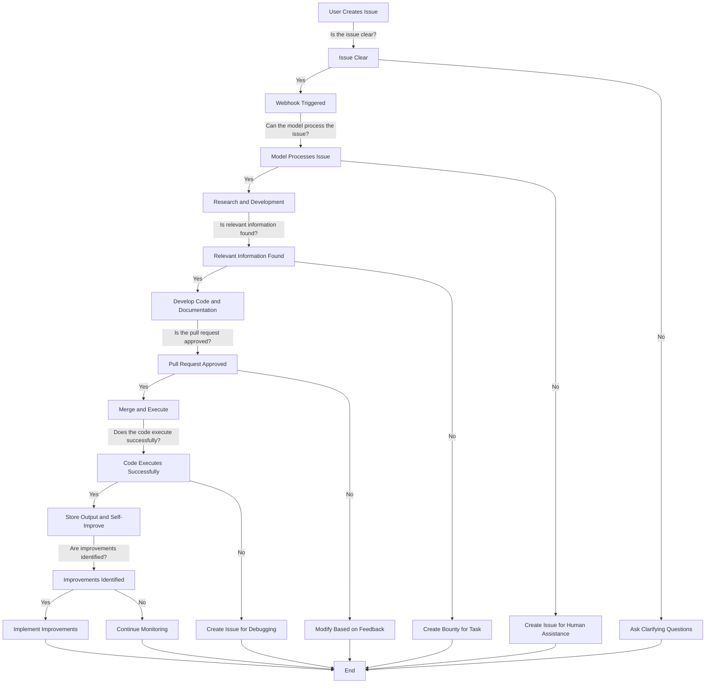

# Self-Improving GitHub Repository

The goal is to turn this project is to create a self-improving GitHub repository. 

We need to index the repository, issues, and comments to create a tool to allow the agents to know what's been built already and provide links to files and ask questions about the project. This will be necessary for all the coding and project management agents.

To do this we need to create tables in the Prisma schema that mirror the Github issues API response including comments and related models. We should prefix these schema tables with `github_` to avoid conflicts with other tables.  I guess we can just keep the snake_case naming convention for the fields to maintain consistency with the Github API and simplify insertion?

For generating the embeddings we can either create an `embeddings` field on the table or a separate embeddings table(s) that can be linked to the GitHub tables.

Then we'll need to create a sync job to update the tables and embeddings on a regular basis.

We'll want a function for querying the embeddings. This will be used in 
- Agents for commenting on issues, adding context, generating code, etc.
- An API endpoint for querying the embeddings
- A chat web interface for querying the embeddings

The function should return the top N most relevant chunks of text from the issue, comments, and related files and links to the sources.

# References
- https://github.com/run-llama/LlamaIndexTS/blob/main/examples/anthropic/agent.ts
- https://github.com/marketplace?type=actions&query=todo+
- https://dosu.dev/
- https://js.langchain.com/v0.1/docs/expression_language/cookbook/retrieval/
- https://js.langchain.com/v0.1/docs/expression_language/cookbook/tools/
- https://github.com/Codium-ai/pr-agent/blob/main/pr_agent/tools/pr_code_suggestions.py

# Required Agents

This will require the following agents:
- Project Manager Agent
- Builder Agent
- Architect Agent
- Researcher Agent
- Human Agent
- Critic Agent
- Webhook Agent
- GitHub Action Agent
- Documentation Agent
- Endpoint Generator Agents - Given requirements generate API endpoints consistent with the existing endpoints.
- Prisma Schema Agent - Given requirements generate data models and relationships in the Prisma schema.

Humans can guide and control the direction by contributing to the documentation, creating/commenting on GitHub issues, and reviewing/merging pull requests.

However, the Project Manager Agent will continuously monitor the state of the code and create issues to address any functional deficiencies.  These issues can be addressed through code contributions by Builder Agents.

Humans review the code contributions and can reject, request changes, or merge them into the main branch if they are acceptable.

## Decision Tree

Here's a simplified version of the decision-making process at each stage,
considering various uncertainties and limitations:

1. **User Creates Issue**
    - **Is the issue clear?**
        - Yes: Proceed to webhook.
        - No: Ask clarifying questions.

2. **Webhook Triggered**
    - **Can the model process the issue?**
        - Yes: Conduct research and development.
        - No: Create an issue for human assistance.

3. **Research and Development**
    - **Is relevant information found?**
        - Yes: Develop code and documentation.
        - No: Create a bounty for the task.

4. **Create Pull Request**
    - **Is the pull request approved by humans?**
        - Yes: Merge and execute.
        - No: Modify based on feedback.

5. **Merge and Execute**
    - **Does the code execute successfully?**
        - Yes: Store output and analyze for self-improvement.
        - No: Create an issue for debugging.

6. **Continuous Self-Improvement**
    - **Are improvements identified?**
        - Yes: Implement improvements.
        - No: Continue monitoring.

7. **Handling Limitations**
    - **Can the system address its limitations?**
        - Yes: Implement solutions.
        - No: Seek human developer intervention.

### Decision Tree Diagram



## Agent Types

### Project Manager Agent

The Project Manager Agent is responsible for monitoring the state of the code
and creating issues to address any functional deficiencies.
These issues can be addressed through code contributions by Builder Agents.

Humans review the code contributions and can reject, request changes,
or merge them into the main branch if they are acceptable.

### Builder Agent

The Builder Agent is responsible for creating code contributions to address issues created by the Project Manager Agent.

### Architect Agent

The Architect Agent is responsible for creating new issues for the Project Manager Agent to address.
These issues should be related to the overall architecture of the project.

### Researcher Agent

The Researcher Agent is responsible for creating new issues for the Project Manager Agent to address.
These issues should be related to the research and development of new features.

### Human Agent

The Human Agent is responsible for creating new issues for the Project Manager Agent to address.
These issues should be related to the need for human assistance.

## Structure

Creating an initial file and folder structure for your self-improving GitHub repository is crucial
for organizing the project and setting the groundwork for future autonomous development.
Here's a proposed structure along with essential files and directories:

```
├── agents/                 # Autonomous agents
│   ├── issue_reader/       # Agent for reading and analyzing issues
│   ├── research_agent/     # Agent for conducting web research
│   └── pr_creator/         # Agent for creating pull requests
│
```


## More Details
1. [Architect Agent](architect-agent.md)

