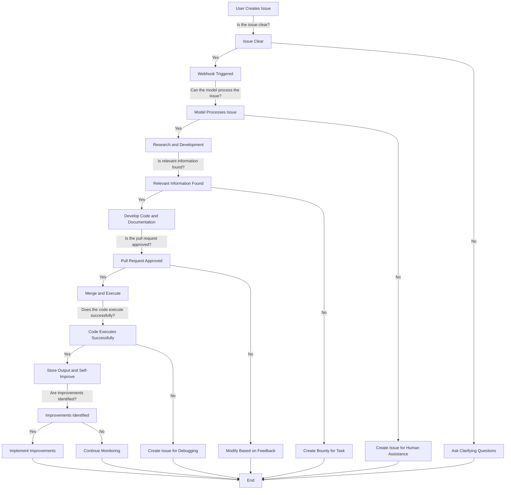

# Self-Improving GitHub Repository

The goal is to turn this project is to create a self-improving GitHub repository.

## Tasks

- [x] Create a Prisma schema for storing Agent definitions, including objectives and data sources.  See https://github.com/wishonia/wishonia/blob/main/prisma/schema.prisma#L381
- [ ] Implement a library/endpoint/UI/tests for creating updating agents (objectives/data sources) based on the Prisma schema.
- [ ] Develop a library/endpoint/UI/test for adding data sources starting with GitHub repositories that can be assigned to agents.  See 
- [ ] Create an API endpoint for creating agents and assigning data sources to them.
- [ ] Page for managing agents, allowing users to create, edit, and delete agents, as well as assign data sources.
- [ ] Page creating and editing agent objectives and data sources.
- [X] Design a Prisma schema for mirroring the GitHub issues API response, including comments and related models. See https://github.com/wishonia/wishonia/blob/main/prisma/schema.prisma#L591
- [ ] Implement a GitHub sync library for syncing repository data, issues, and comments using Octokit.
- [ ] Generate embeddings for the indexed repository data, either by adding an `embeddings` field to the existing tables or creating separate embedding tables linked to the GitHub tables. Using an embeddings table is simplest, but the content of each record may need to have multiple chunks in which case, it would require multiple records and wouldn't be able to be stored in a single embeddings field. Here are some instructions  https://js.langchain.com/v0.2/docs/how_to/indexing/ to create embeddings without wasting money on reindexing content that already has embeddings. It also should update embeddings and delete the old ones when the files in the repo change based on the github repo changelog.
- [ ] Set up a sync job using GitHub Actions and/or webhooks to regularly update the tables and embeddings.
- [ ] Create a chat endpoint/UI for querying the embeddings, which will be used by agents for commenting on issues, adding context, generating code, and in API endpoints and chat interfaces.
- [ ] Design and implement the following agents in the UI for managing the GitHub project:
    - [ ] Project Manager Agent
    - [ ] Issue Triager Agent
    - [ ] Requirements Analyzer Agent
    - [ ] Solution Architect Agent
    - [ ] Development Team Agent
    - [ ] Code Reviewer Agent
    - [ ] Issue Commenter Agent
    - [ ] Continuous Integration (CI) Agent
    - [ ] Documentation Agent
    - [ ] Prisma Schema Manager Agent
    - [ ] API Endpoint Generator Agent
    - [ ] UI Component Generator Agent
- [ ] Develop the necessary tools (https://js.langchain.com/v0.1/docs/expression_language/cookbook/tools/) and capabilities for the agents, including:
    - [ ] Repository Querying Tool with RAG (Retrieval-Augmented Generation)
    - [ ] Issue Creation and Management Tool
    - [ ] Issue Search and Filtering Tool
    - [ ] Pull Request Management Tool
- [ ] Implement the decision-making process for the agents, following the provided decision tree diagram.
- [ ] Set up continuous monitoring and self-improvement mechanisms for the agents to identify and implement improvements.
- [ ] Establish a process for handling limitations and seeking human intervention when necessary.
- [ ] Conduct thorough testing and validation of the self-improving GitHub repository system.
- [ ] Deploy the system and monitor its performance, making adjustments as needed.
- [ ] Continuously iterate and improve the system based on feedback and identified areas for enhancement.

## Step 1: Create function for creating agents

We need to store the Agent definitions (objectives, their data sources) in the Postgres database using the [Prisma schema](../../../prisma/schema.prisma). 

See Agent model in https://github.com/wishonia/wishonia/blob/main/prisma/schema.prisma#L418

## Step 2. Create Jest test for agent creation

We need to create a Jest test to ensure that the agents are created correctly and that they can be queried from the database.

## Step 3. Create function for adding GitHub repos as data sources that can be assigned to agents

We need to create a function that allows us to add GitHub repositories as data sources that can be assigned to agents. This will allow the agents to access the repository data and perform their tasks.

See AgentSource model in https://github.com/wishonia/wishonia/blob/main/prisma/schema.prisma#L418

## Create API Endpoint for Creating Agents

We need to create an API endpoint that allows us to create agents and assign data sources to them. This will allow us to manage the agents and their data sources through a web interface.

## Create Page for Managing Agents

We need to create a web page that allows us to manage the agents and their data sources. This page should allow us to create, edit, and delete agents, as well as assign data sources to them.

## Create Page for Creating/Editing Agent Objective and Data Sources

We need to create a web page that allows us to create and edit agent objectives and data sources. 
This page should allow us to define the objectives of the agents and assign data sources to them.

## Create GitHub Sync Library for GitHub Repo Data Sources

We need to index the repository, issues, and comments to create a tool to allow the agents to know what's been built already and provide links to files and ask questions about the project. This will be necessary for all the coding and project management agents.

To do this,
we created tables in the Prisma schema that mirror the GitHub issues API response including comments and related models.
See GitHub models in https://github.com/wishonia/wishonia/blob/main/prisma/schema.prisma#L591

**Generate Embeddings**

For generating the embeddings,
we can either create an `embeddings` field on the table or a separate embeddings table(s)
that can be linked to the GitHub tables.

## Step 5: Create GitHub Action and/or Webhooks for Syncing GitHub Repo Data

Then we'll need to create a sync job to update the tables and embeddings on a regular basis.

## Step 6: Create Function for Querying Embeddings

We'll want a function for querying the embeddings. This will be used in
- Agents for commenting on issues, adding context, generating code, etc.
- An API endpoint for querying the embeddings
- A chat web interface for querying the embeddings

The function should return the top N most relevant chunks of text from the issue, comments, and related files and links to the sources.

# References
- https://github.com/run-llama/LlamaIndexTS/blob/main/examples/anthropic/agent.ts
- https://github.com/marketplace?type=actions&query=todo+
- https://dosu.dev/
- https://js.langchain.com/v0.1/docs/expression_language/cookbook/retrieval/
- https://js.langchain.com/v0.1/docs/expression_language/cookbook/tools/
- https://github.com/Codium-ai/pr-agent/blob/main/pr_agent/tools/pr_code_suggestions.py

# Create Agents in the UI for managing the GitHub project

To design a process where AI agents manage a GitHub project, automatically plan and prioritize development, and create and make helpful comments on GitHub issues, we would need several specialized agents with focused objectives. Here's a breakdown of the required agents and their objectives:

1. Project Manager Agent:
   - Objective: Oversee the entire project and coordinate the activities of other agents.
   - Responsibilities:
      - Monitor the overall progress of the project.
      - Communicate with stakeholders and provide project updates.
      - Ensure smooth collaboration between different agents.

2. Issue Triager Agent:
   - Objective: Analyze and prioritize incoming GitHub issues.
   - Responsibilities:
      - Assess the urgency and importance of each issue.
      - Categorize issues based on their type (bug, feature request, etc.).
      - Assign priority labels to issues (e.g., high, medium, low).
      - Route issues to the appropriate agent for further action.

3. Requirements Analyzer Agent:
   - Objective: Analyze and clarify requirements from GitHub issues.
   - Responsibilities:
      - Review issue descriptions and comments to understand user requirements.
      - Identify missing or ambiguous information in issue descriptions.
      - Engage with issue reporters to gather additional details when needed.
      - Document clear and concise requirements for each issue.

4. Solution Architect Agent:
   - Objective: Design and propose technical solutions for GitHub issues.
   - Responsibilities:
      - Analyze requirements and constraints for each issue.
      - Propose high-level architectural designs and implementation approaches.
      - Identify potential risks and dependencies associated with proposed solutions.
      - Collaborate with the Development Team Agent to refine and finalize solutions.

5. Development Team Agent:
   - Objective: Manage the development process and assign tasks to developers.
   - Responsibilities:
      - Break down GitHub issues into smaller, manageable tasks.
      - Assign tasks to individual developers based on their skills and availability.
      - Monitor the progress of development tasks and provide guidance when needed.
      - Ensure code quality and adherence to project standards.

6. Code Reviewer Agent:
   - Objective: Review and provide feedback on code changes.
   - Responsibilities:
      - Perform code reviews for pull requests.
      - Ensure code changes meet project guidelines and best practices.
      - Provide constructive feedback and suggestions for improvement.
      - Approve or request changes to pull requests based on the review.

7. Issue Commenter Agent:
   - Objective: Provide helpful comments and updates on GitHub issues.
   - Responsibilities:
      - Monitor issue discussions and provide timely responses.
      - Offer guidance and troubleshooting suggestions to issue reporters.
      - Keep issue reporters informed about the progress and status of their issues.
      - Close resolved issues and provide explanations for the resolution.

8. Continuous Integration (CI) Agent:
   - Objective: Automate the build, testing, and deployment processes.
   - Responsibilities:
      - Configure and maintain the CI pipeline.
      - Trigger automated builds and tests whenever code changes are pushed.
      - Report build and test results to the relevant agents.
      - Deploy successful builds to the appropriate environments.

9. Documentation Agent:
   - Objective: Maintain and update project documentation.
   - Responsibilities:
      - Generate and update API documentation based on code changes.
      - Maintain user guides, tutorials, and project wiki.
      - Collaborate with other agents to ensure documentation accuracy and completeness.

10. Prisma Schema Manager Agent:
- Objective: Manage and maintain the Prisma schema for the project.
- Responsibilities:
   - Design and define the database schema using Prisma's schema language.
   - Handle schema migrations and database updates.
   - Ensure the schema is consistent with the application's data requirements.
   - Collaborate with the Development Team Agent to incorporate schema changes.

11. API Endpoint Generator Agent:
- Objective: Generate API endpoints based on the project's requirements.
- Responsibilities:
   - Analyze the project's feature requirements and identify necessary API endpoints.
   - Design and define the structure and behavior of API endpoints.
   - Generate code for the API endpoints, including request handling and response formatting.
   - Integrate the generated endpoints with the project's backend framework.

12. UI Component Generator Agent:
- Objective: Generate UI components for the project's features.
- Responsibilities:
   - Analyze the project's UI design and feature requirements.
   - Generate reusable UI components based on the design specifications.
   - Ensure the generated components are modular, responsive, and accessible.
   - Integrate the generated components into the project's frontend framework.

# Agent Tools

To enable effective collaboration and automation among the AI agents, they will require a set of shared tools and capabilities. Here's a list of the essential tools and features:

1. Repository Querying Tool with RAG (Retrieval-Augmented Generation):
   - Enables agents to query and retrieve relevant information from the project's codebase and documentation.
   - Utilizes RAG techniques to generate accurate and contextually relevant responses based on the retrieved information.
   - Supports natural language queries and code-specific searches.

2. Issue Creation and Management Tool:
   - Allows agents to create, assign, and manage GitHub issues.
   - Supports automatic issue creation based on predefined templates and criteria.
   - Enables agents to update issue status, add comments, and attach relevant files or screenshots.

3. Issue Search and Filtering Tool:
   - Provides powerful search and filtering capabilities for GitHub issues.
   - Allows agents to search issues based on keywords, labels, assignees, status, and other relevant criteria.
   - Enables agents to quickly find and prioritize issues based on their specific requirements.

4. Pull Request Management Tool:
   - Facilitates the creation, review, and merging of pull requests.
   - Allows agents to automatically create pull requests based on completed tasks or feature branches.
   - Supports code review workflows, enabling agents to provide feedback and approve or request changes.

## Decision Tree

Here's a simplified version of the decision-making process at each stage,
considering various uncertainties and limitations:

1. **User Creates Issue**
    - **Is the issue clear?**
        - Yes: Proceed to webhook.
        - No: Ask clarifying questions.

2. **Webhook Triggered**
    - **Can the model process the issue?**
        - Yes: Conduct research and development.
        - No: Create an issue for human assistance.

3. **Research and Development**
    - **Is relevant information found?**
        - Yes: Develop code and documentation.
        - No: Create a bounty for the task.

4. **Create Pull Request**
    - **Is the pull request approved by humans?**
        - Yes: Merge and execute.
        - No: Modify based on feedback.

5. **Merge and Execute**
    - **Does the code execute successfully?**
        - Yes: Store output and analyze for self-improvement.
        - No: Create an issue for debugging.

6. **Continuous Self-Improvement**
    - **Are improvements identified?**
        - Yes: Implement improvements.
        - No: Continue monitoring.

7. **Handling Limitations**
    - **Can the system address its limitations?**
        - Yes: Implement solutions.
        - No: Seek human developer intervention.

### Decision Tree Diagram

