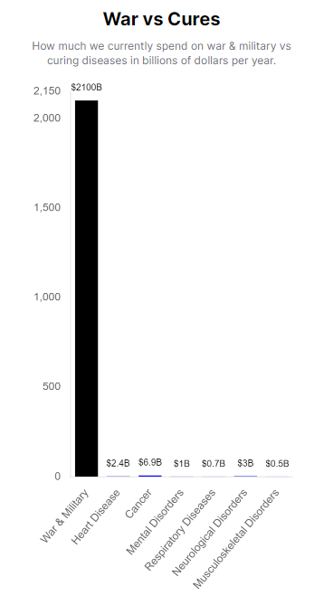

The Decentralized Institutes of Health (DIH) is a global initiative that aims to revolutionize healthcare research and funding by harnessing the power of decentralized science, collective intelligence, and blockchain technology. Our mission is to create a transnational, democratically governed, and trustless repository that enables governments worldwide to redirect resources from funding war to finding cures for diseases. By signing the 1% Treaty, governments pledge to allocate just 1% of their military spending to the DIH, unlocking billions of dollars for life-saving research.

# Why the DIH?
Today, governments collectively spend over 20 times more on war and the military than on helping the 2 billion people suffering from chronic diseases. 

This imbalance in priorities has led to a global health crisis, with millions of lives lost each year to preventable and treatable conditions. The DIH aims to correct this imbalance by providing a platform for governments to easily and transparently redirect a portion of their military budgets to medical research.

# The 1% Treaty
The [1% Treaty](globalSolutions/1-percent-treaty/1-percent-treaty.mdercent-treaty/1-percent-treaty.md) is an agreement that enables governments to join the DIH and contribute to its mission. By signing the treaty, governments pledge to allocate 1% of their military spending to the DIH democratic crowdfunding platform. This small but significant contribution has the potential to generate billions of dollars for medical research, accelerating the development of life-saving treatments and cures.

# Unique Value Proposition
1. **Global Cooperation**: The DIH fosters unprecedented collaboration among nations, researchers, and individuals, transcending borders and political differences to address the world's most pressing health challenges.

2. **Democratic Governance**: Our decentralized, trustless platform ensures that everyone has an equal say in decision-making, preventing any single entity from dominating the agenda.

3. **Collective Intelligence**: We employ an innovative funding allocation mechanism that harnesses the wisdom of the crowd to identify the most promising research projects. By randomly presenting participants with pairs of projects and aggregating their preferences, we overcome the information overload associated with traditional crowdfunding.

4. **Transparent and Accountable**: Built on blockchain technology, the DIH maintains a transparent and immutable record of all transactions and decisions, ensuring the highest levels of accountability and trust.

5. **Catalyzing Medical Breakthroughs**: By pooling resources from governments, organizations, and individuals worldwide, the DIH accelerates the development of life-saving treatments and cures that might otherwise remain underfunded.

# How It Works
1. Governments sign the [1% Treaty](globalSolutions/1-percent-treaty/1-percent-treaty.mdercent-treaty/1-percent-treaty.md)
 pledging to allocate 1% of their military spending to the DIH's decentralized, trustless repository.

2. Researchers and scientists submit their project proposals to the DIH platform.

3. Participants are randomly presented with pairs of projects and asked to select the one they believe is most deserving of funding.

4. The DIH aggregates participant preferences using advanced algorithms to determine the optimal allocation of funds.

5. Funded projects are required to share their findings and results openly, contributing to a global knowledge base accessible to all.

# Global Impact
By redirecting just 1% of military spending to medical research, the DIH has the potential to transform the lives of billions of people suffering from chronic diseases. By simply showing your support for this effort, you can help to create a world with much less suffering from both disease and senseless violence.
